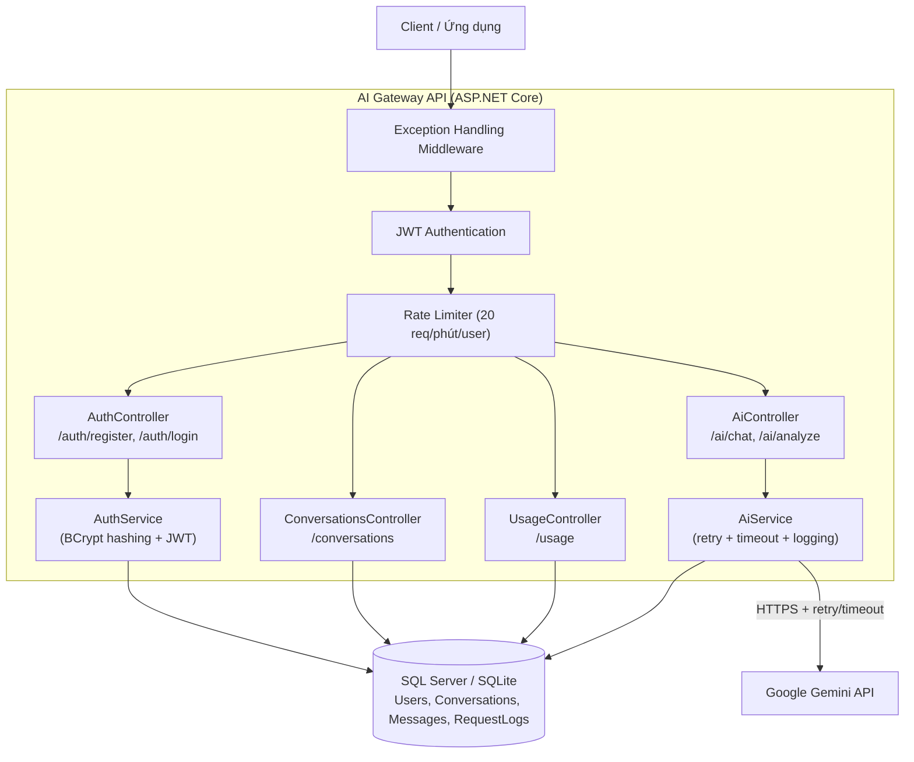
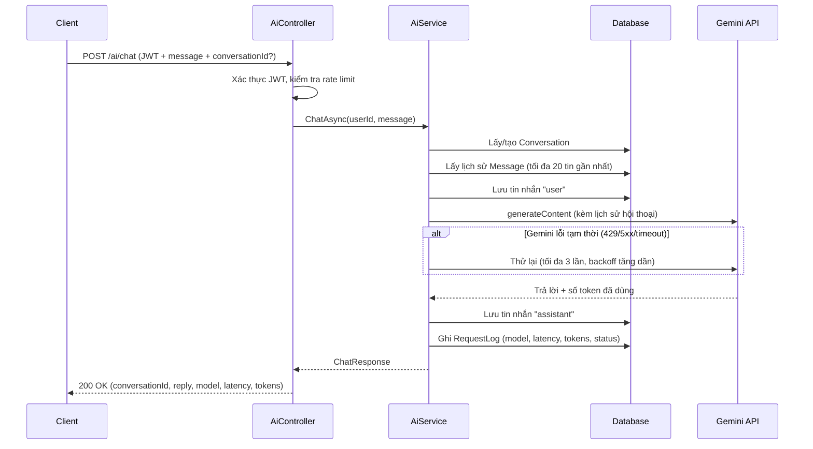
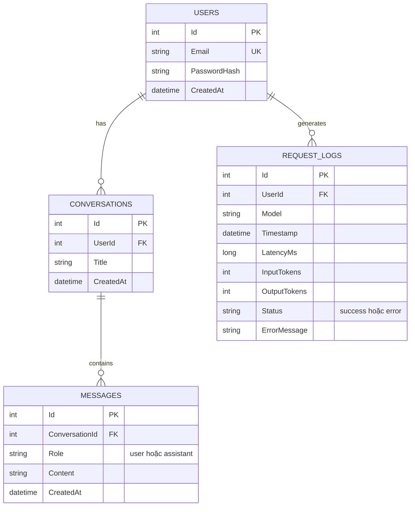

# AI Gateway API

Backend service đóng vai trò **cổng trung tâm (gateway)** giữa các ứng dụng và nhà cung cấp AI (Google Gemini), xử lý authentication, lưu trữ hội thoại, theo dõi usage và đảm bảo độ tin cậy khi gọi LLM.

Dự án làm cho **7-Day AI Builder Challenge – Build an AI Gateway API** (Backend Developer).

- **Deployed API:** https://ai-gateway-s94z.onrender.com
- **Swagger UI:** https://ai-gateway-s94z.onrender.com/swagger
- **Source code:** https://github.com/VanHuy2221/AI-Gateway.git

> **Lưu ý:** API deploy trên gói miễn phí của Render, server sẽ "ngủ" sau 15 phút không có traffic. Request đầu tiên sau khi ngủ có thể mất 30–60 giây để khởi động lại — đây là hành vi bình thường của gói free, không phải lỗi.

---

## 1. Vấn đề & giải pháp

**Vấn đề:** Một công ty có nhiều ứng dụng cùng dùng tính năng AI. Nếu mỗi ứng dụng tự gọi trực tiếp OpenAI/Gemini/Claude, việc quản lý API key, theo dõi chi phí, đảm bảo độ tin cậy (retry, timeout, rate limit) và log lại việc sử dụng sẽ bị lặp lại và khó kiểm soát ở nhiều nơi.

**Giải pháp:** Xây một backend service (AI Gateway) đứng giữa ứng dụng và nhà cung cấp AI. Ứng dụng chỉ cần gọi API của gateway (đã có JWT auth riêng), gateway lo phần gọi LLM, retry khi lỗi tạm thời, giới hạn tần suất, lưu lịch sử hội thoại và ghi log đầy đủ cho từng request để phục vụ theo dõi usage.

---

## 2. Kiến trúc hệ thống



### Luồng xử lý một request chat (`POST /ai/chat`)



---

## 3. Cấu trúc Database
 


- **Users**: tài khoản, mật khẩu băm bằng BCrypt (không lưu plaintext).
- **Conversations**: một hội thoại thuộc về một user, có tiêu đề tự lấy từ tin nhắn đầu tiên.
- **Messages**: từng lượt trao đổi trong hội thoại, `Role` là `user` hoặc `assistant`. Khi gọi Gemini, lịch sử này được nạp lại (tối đa 20 tin gần nhất) để AI có ngữ cảnh.
- **RequestLogs**: một dòng cho **mỗi lần** gọi AI (kể cả khi lỗi), phục vụ endpoint `/usage`.

---

## 4. API Design

Tất cả endpoint (trừ `/health`, `/auth/register`, `/auth/login`) yêu cầu header:

```
Authorization: Bearer <token>
```

| Method | Endpoint | Auth | Mô tả |
|---|---|---|---|
| GET | `/health` | Không | Kiểm tra server còn sống |
| POST | `/auth/register` | Không | Đăng ký tài khoản, trả JWT |
| POST | `/auth/login` | Không | Đăng nhập, trả JWT |
| POST | `/ai/chat` | Có | Gửi tin nhắn chat, có nhớ ngữ cảnh qua `conversationId` |
| POST | `/ai/analyze` | Có | Phân tích văn bản, trả JSON có cấu trúc |
| GET | `/conversations` | Có | Danh sách hội thoại của user hiện tại |
| GET | `/conversations/{id}` | Có | Chi tiết một hội thoại kèm toàn bộ tin nhắn |
| GET | `/usage` | Có | Thống kê tổng: số request, token, latency trung bình, tỉ lệ lỗi |

**Cách tính các chỉ số:**
- `requests` = tổng số dòng trong bảng `RequestLogs` (mỗi lần gọi AI ghi đúng 1 dòng, kể cả khi lỗi).
- `tokens` = tổng `InputTokens + OutputTokens` cộng dồn trên toàn bộ log.
- `average_latency_ms` = trung bình cộng của `LatencyMs` trên toàn bộ log.
- `error_rate` = (số log có `Status = "error"`) / (tổng số log).

Đầy đủ ví dụ request/response: xem file `postman_collection.json` đính kèm.

---

## 5. Tích hợp AI (Gemini)

- Gọi trực tiếp **Google Gemini API** (`generateContent`) qua `HttpClient`, model cấu hình được qua `appsettings.json` / biến môi trường (`Gemini:Model`), hiện dùng `gemini-3.5-flash-lite`.
- **Lưu hội thoại có ngữ cảnh:** mỗi lần gọi `/ai/chat`, hệ thống nạp lại tối đa 20 tin nhắn gần nhất từ DB, chuyển thành định dạng `contents` mà Gemini yêu cầu (map `Role: "assistant"` → `role: "model"`), giúp AI "nhớ" được hội thoại.
- **Structured output** cho `/ai/analyze`: dùng `generationConfig.responseSchema` của Gemini để ép model trả JSON đúng theo schema định sẵn (`summary`, `sentiment`, `keywords`) thay vì tự parse văn bản tự do — đáng tin cậy hơn nhiều so với parse thủ công.
- **Token usage:** lấy trực tiếp từ `usageMetadata.promptTokenCount` / `candidatesTokenCount` mà Gemini trả về, không tự ước tính — đảm bảo số liệu `/usage` chính xác.

---

## 6. Chiến lược xử lý lỗi & độ tin cậy

| Cơ chế | Chi tiết |
|---|---|
| **Retry** | Tối đa 3 lần cho lỗi tạm thời (HTTP 429, 5xx, lỗi mạng, timeout), backoff tăng dần (2s, 4s, 8s) |
| **Timeout** | 20 giây/lần gọi Gemini, dùng `CancellationTokenSource` |
| **Rate limiting** | 20 request/phút/user (theo `userId` nếu đã đăng nhập, theo IP nếu chưa), trả `429` khi vượt |
| **Error handling tầng controller** | Mỗi endpoint AI có try/catch riêng, trả mã lỗi phù hợp (`400` thiếu dữ liệu, `502` không gọi được Gemini) |
| **Global exception middleware** | Bắt mọi lỗi chưa xử lý, trả JSON lỗi thống nhất thay vì để server crash lộ stack trace |
| **Logging** | Ghi log qua `ILogger` cho mọi lần retry, lỗi Gemini, và exception toàn cục |
| **Request logging cho usage** | Mọi lần gọi AI (kể cả lỗi) đều ghi 1 dòng vào `RequestLogs`, phục vụ `/usage` |

---

## 7. Chạy dự án ở local

### Yêu cầu
- .NET 9 SDK
- SQL Server (local, dùng Windows Authentication) **hoặc** đổi sang SQLite (xem mục Deploy)
- API key của Google Gemini (đặt biến môi trường `GEMINI_API_KEY`)

### Các bước

```bash
git clone https://github.com/VanHuy2221/AI-Gateway.git
cd AI-Gateway/AI-Test

# Cấu hình connection string trong appsettings.json (mục ConnectionStrings:DefaultConnection)
# Đặt API key
setx GEMINI_API_KEY "your-gemini-api-key"

dotnet restore
dotnet ef database update
dotnet run
```

Mở `https://localhost:<port>/swagger` để test.

---

## 8. Deploy

Deploy bằng **Docker** trên **Render.com** (gói Free). Vì môi trường deploy không truy cập được SQL Server chạy trên máy cá nhân, bản deploy dùng **SQLite** thay thế — chuyển đổi được nhờ EF Core trừu tượng hóa provider, chỉ cần đổi cấu hình (`Database:Provider`), không phải viết lại code.

| Biến môi trường | Giá trị (bản deploy) |
|---|---|
| `Database__Provider` | `Sqlite` |
| `ConnectionStrings__DefaultConnection` | `Data Source=aigateway.db` |
| `Jwt__Key`, `Jwt__Issuer`, `Jwt__Audience` | (theo cấu hình JWT) |
| `Gemini__Model` | `gemini-2.5-flash-lite` |
| `GEMINI_API_KEY` | API key thật |

Xem `Dockerfile` để biết chi tiết build/publish image.

---

## 9. AI trong dự án này

Dự án được xây với sự hỗ trợ của **Claude** (kiến trúc, phần lớn code, sửa lỗi, viết tài liệu) và **ChatGPT** (bản đầu tiên của phần tích hợp Gemini). Chi tiết đầy đủ về prompt đã dùng, lỗi AI mắc phải và cách khắc phục: xem [`AI_WORKLOG.md`](./AI_WORKLOG.md).

---

## 10. Hạn chế đã biết (Known Limitations)

- **Quota Gemini free tier có giới hạn:** model flagship như `gemini-3.8-flash` chỉ cho 20 request/ngày ở gói free; dự án dùng `gemini-3.5-flash-lite` để có quota rộng hơn phục vụ demo, nhưng vẫn có thể hết quota nếu test dồn dập.
- **SQLite trên Render free tier không bền vững lâu dài:** ổ đĩa có thể bị reset khi container khởi động lại, nên dữ liệu bản deploy demo không đảm bảo tồn tại vĩnh viễn. Với môi trường production thật, nên dùng PostgreSQL/SQL Server có persistent storage.
- **Cold start:** server ngủ sau 15 phút không hoạt động (gói Free của Render), request đầu tiên sau đó chậm.
- **Rate limit đơn giản:** áp dụng một mức giới hạn chung (20 req/phút) cho mọi user, chưa phân hạng theo gói dịch vụ.
- **Chưa làm các phần bonus:** multi-model routing, fallback model, queue-based processing, caching, cost estimation, observability/dashboard.
- **`/usage` tổng hợp trên toàn hệ thống**, chưa lọc riêng theo từng user (có thể mở rộng dễ dàng bằng cách thêm filter `UserId` vào truy vấn).

## 11. Nếu có thêm 7 ngày

Xem mục tương ứng trong [`AI_WORKLOG.md`](./AI_WORKLOG.md).
